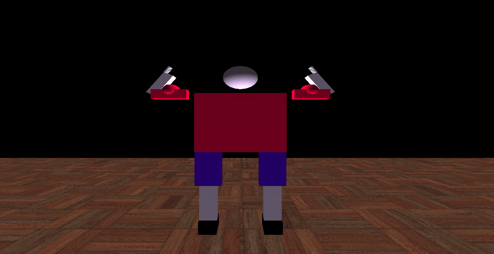
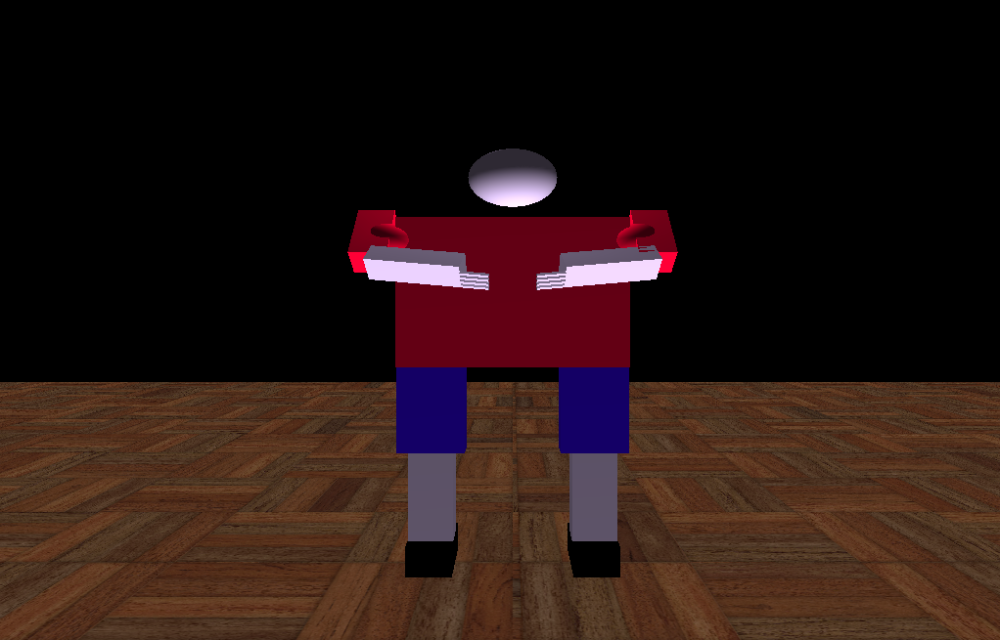
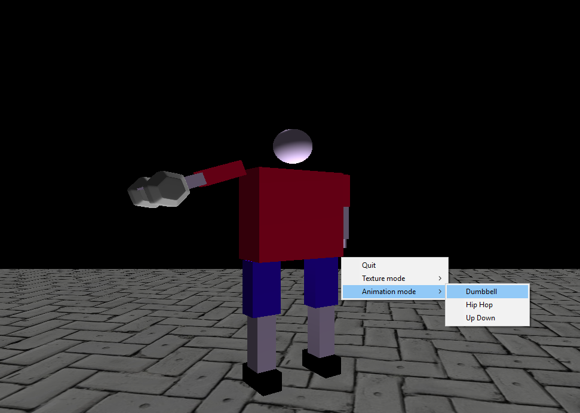
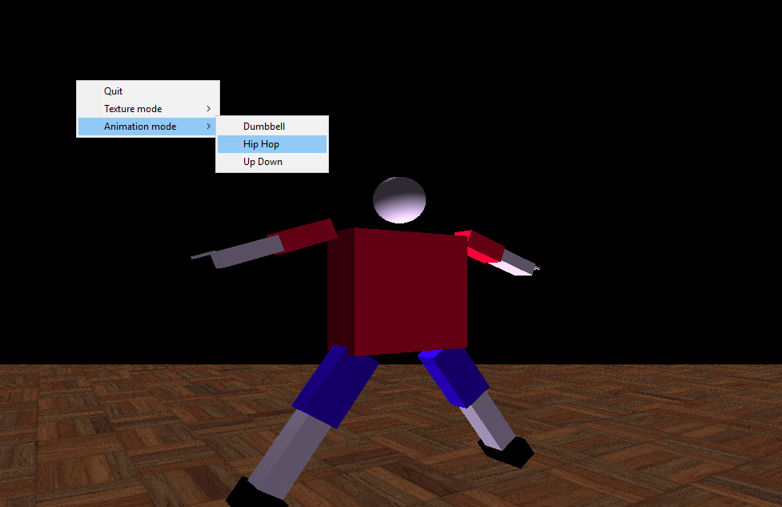
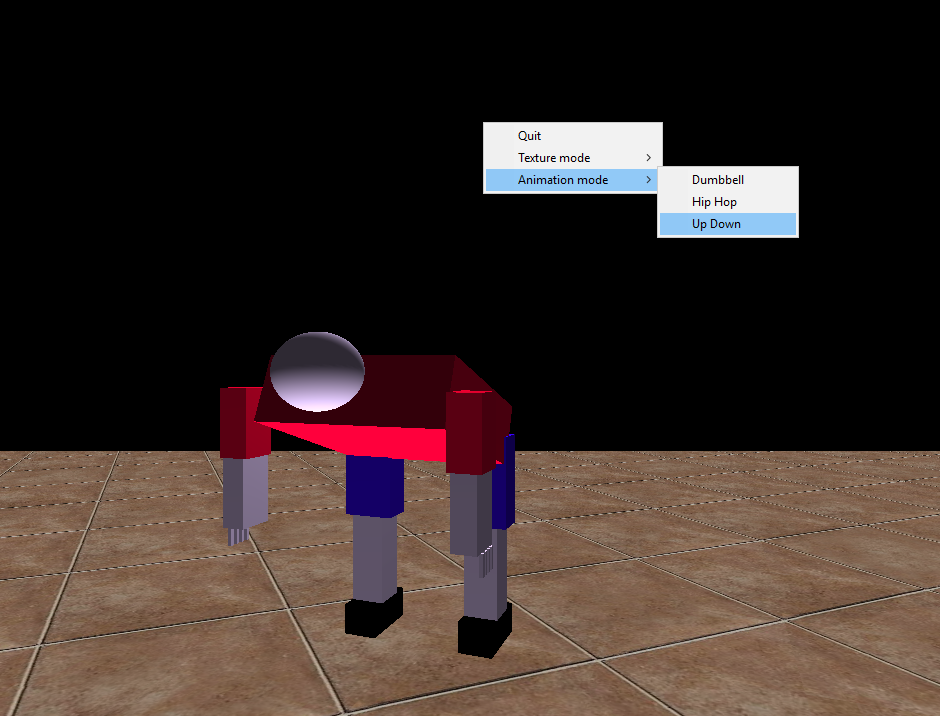
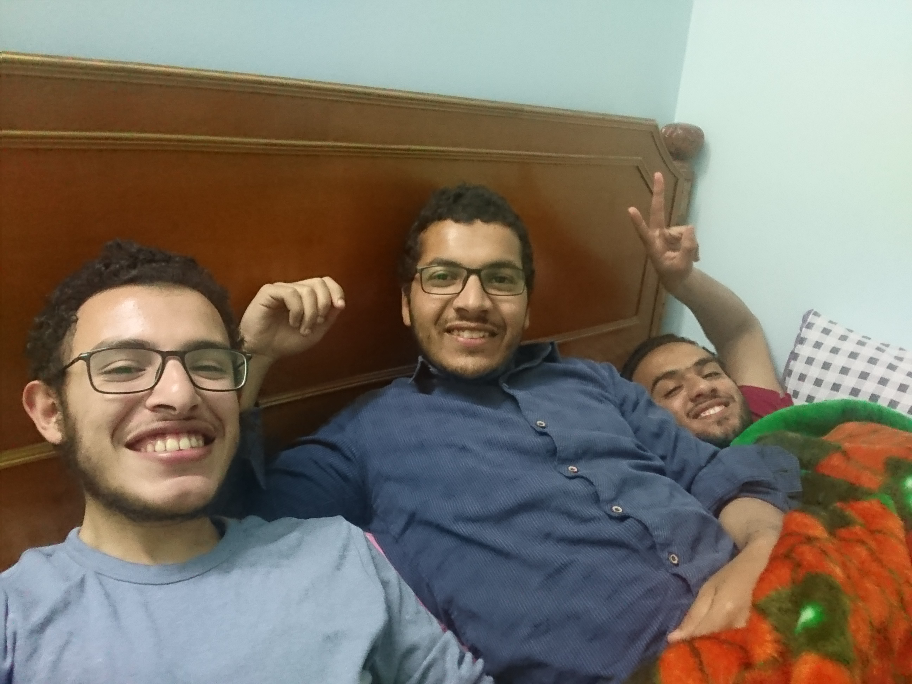

# sbe306-assignment3-team-14-1 . (**Gym**)
| Team Members | SEC | BN |
|--------------|-------------|---------|
| **Ahmed Gamal**  | 1 |1|
| **Hazem Muhammad**| 1 | 32 |
| **Sohail Ahmed** | 2 | 1|
|**Mohamed Gamal** |2 |20|

## Content
<!-- TOC -->
- [Content](#Content)
- [Requirements](#Requirements)
- [Implementation](#Implementation)
- [Results](#Results)
- [Issues](#Issues)

## Requirements
1. draw a floor and put the full body on top of it.
2. put a texture on the floor
3. use a menu binned to the right mouse button to change the floor texture.
4. you are required to to design Three animations:
	- Two of them using the robotic body without interaction with any object.
	- the last animation: the robotic body should interact with loaded objects
5. download different objects and load it in your scene to make sense of the animation environment.

## Implementation
We made a graphic design about gym and made 2 animations using timer function (**glutTimerFunc()**) and Swap Buffer (**glutSwapBuffers()**).
Example
```sh
void timer(int value)
{
int l=300;
int l2=300;
    if (value == 1)
    {    
      if (shoulder2 < 90)
      {
         shoulder2 = (shoulder2 + 5) % 360;
		     glutPostRedisplay();
         glutTimerFunc(l, timer, 1);
      }
	  if  (rshoulder2 < 180)
	  {
		rshoulder2 = (rshoulder2 + 5) % 360;
		glutPostRedisplay();
		glutTimerFunc(l, timer, 1);
	  }
	  else if  (elbow2 > -120)
	  {
		 
		elbow2 = (elbow2 - 5) % 360;
		glutPostRedisplay();
		glutTimerFunc(l, timer, 1);
		
	  }
	  
    else 
	  glutTimerFunc(l, timer, 2);
	}
}	
```


## Results






## Issues
* We ran out of time due to the preperation for the wedding of our beloved friend's -Ahmed- sister and we had to stay up all the night to finish the task and push directly from the bed.

